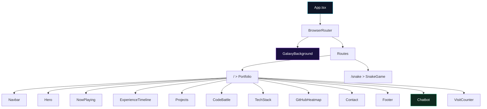

<p align="center">
  
</p>

<p align="center">
  <a href="https://github.com/aviral022"></a>
  <a href="https://www.linkedin.com/in/aviral-dubey-ml-engineer"></a>
  <a href="mailto:er.aviraldubey@gmail.com"></a>
</p>

<p align="center">
  
  
  
  
  
  
  
  
</p>

---

## Overview

A **production grade, full stack developer portfolio** built with a modern, futuristic design aesthetic. It features an immersive galaxy themed UI with glassmorphism, aurora lighting effects, and buttery smooth animations, all backed by a robust Python API serving dynamic content from a SQLite database.

This is not just a static resume page. It is an interactive experience complete with an **AI powered chatbot**, a **live coding challenge**, a **retro snake game**, **real time visitor analytics**, and more.

---

## Key Features

| Feature | Description |
|---|---|
| **Galaxy Background** | Animated HTML5 Canvas star field with parallax scrolling and aurora lighting blobs |
| **AI Chatbot** | Intelligent portfolio assistant powered by TF IDF and cosine similarity with intent detection, small talk handling, and structured responses |
| **Code Battle** | Live interactive coding challenge section to showcase problem solving skills |
| **Snake Game** | Full retro snake game accessible via the `/snake` route as a fun Easter egg |
| **Now Playing** | Now Playing music and activity widget for a personal touch |
| **GitHub Heatmap** | Visual contribution heatmap showcasing coding activity |
| **Experience Timeline** | Professional experience displayed in an elegant animated timeline |
| **Tech Stack Grid** | Categorized skills across 9 categories with color coded glassmorphism cards |
| **Contact Form** | Functional contact form that persists messages to the database |
| **Visitor Counter** | Real time visitor count tracking via the backend analytics API |
| **Resume Download** | One click downloadable resume in PDF format |
| **Rotating Roles** | Animated rotating role titles in the hero section |

---

## Architecture

```
portfolio/
|
|__ backend/                        Python FastAPI server
|   |__ main.py                     Application entry point and API routes
|   |__ database.py                 SQLite setup, schema, and seed data
|   |__ chatbot.py                  TF IDF chatbot engine with NLP
|   |__ requirements.txt            Python dependencies
|   |__ portfolio.db                SQLite database (auto generated)
|
|__ frontend/                       React + TypeScript SPA
|   |__ src/
|   |   |__ App.tsx                 Root component with routing
|   |   |__ api.ts                  Axios API client
|   |   |__ main.tsx                React DOM entry point
|   |   |__ index.css               Global styles and design system
|   |   |__ components/
|   |       |__ Hero.tsx            Landing section with bio and socials
|   |       |__ Navbar.tsx          Responsive navigation bar
|   |       |__ NowPlaying.tsx      Now playing activity widget
|   |       |__ ExperienceTimeline.tsx  Work experience timeline
|   |       |__ Projects.tsx        Project showcase cards
|   |       |__ CodeBattle.tsx      Interactive coding challenge
|   |       |__ TechStack.tsx       Skills grid by category
|   |       |__ GitHubHeatmap.tsx   GitHub contribution heatmap
|   |       |__ Contact.tsx         Contact form
|   |       |__ Chatbot.tsx         AI chatbot widget
|   |       |__ SnakeGame.tsx       Retro snake game
|   |       |__ GalaxyBackground.tsx  Animated star field canvas
|   |       |__ VisitCounter.tsx    Visitor analytics display
|   |       |__ Footer.tsx          Site footer
|   |__ index.html                  HTML shell
|   |__ vite.config.ts              Vite configuration with API proxy
|   |__ tsconfig.json               TypeScript configuration
|   |__ package.json                Node.js dependencies
|
|__ start.bat                       One click launcher for Windows
|__ README.md                       You are here
```

---

## Tech Stack

### Frontend
| Technology | Purpose |
|---|---|
| **React 19** | Component based UI framework |
| **TypeScript 5.9** | Type safe JavaScript development |
| **Vite 7** | Lightning fast build tooling and HMR |
| **Tailwind CSS 4** | Utility first CSS framework |
| **Framer Motion 12** | Declarative animations and transitions |
| **React Router 7** | Client side routing for `/` and `/snake` |
| **Axios** | HTTP client for API communication |
| **React Icons** | Comprehensive icon library |

### Backend
| Technology | Purpose |
|---|---|
| **Python 3.10+** | Server side runtime |
| **FastAPI** | High performance async REST framework |
| **Uvicorn** | ASGI server for production deployments |
| **SQLite** | Lightweight embedded relational database |
| **Scikit learn** | TF IDF vectorization and cosine similarity for the chatbot |
| **Pydantic** | Data validation and serialization |

---

## Getting Started

### Prerequisites

- **Node.js** 18+ and **npm**
- **Python** 3.10+
- **pip** (Python package manager)

### Quick Start (Windows)

The easiest way to launch the entire stack:

```bash
start.bat
```

This script automatically starts both the backend and frontend servers, and opens the portfolio at `http://localhost:5173`.

### Manual Setup

#### 1. Backend

```bash
cd backend

pip install -r requirements.txt

python -m uvicorn main:app --host 0.0.0.0 --port 8000
```

> **Note:** The SQLite database (`portfolio.db`) is **automatically created and seeded** with initial data on the first server start. No manual database setup is required.

#### 2. Frontend

```bash
cd frontend

npm install

npm run dev
```

The frontend opens at **`http://localhost:5173`** with an API proxy configured to forward requests to `http://localhost:8000`.

### Production Build

```bash
cd frontend

# Compile TypeScript and build production bundle
npm run build        # Outputs to dist/

# Preview the production build locally
npm run preview
```

For production deployment, serve the `dist/` folder with any static file server (such as Nginx, Vercel, or Netlify) and configure API calls to point to the backend URL.

---

## API Reference

The backend exposes a RESTful API at `http://localhost:8000`.

| Method | Endpoint | Description |
|---|---|---|
| `GET` | `/api/projects` | Retrieve all projects sorted by display order |
| `GET` | `/api/experience` | Retrieve professional experience entries |
| `GET` | `/api/skills` | Retrieve categorized technical skills |
| `POST` | `/api/contact` | Submit a contact form message |
| `GET` | `/api/contacts` | **Admin** List all submitted contact messages |
| `POST` | `/api/chatbot` | Send a query to the AI chatbot |
| `GET` | `/api/analytics` | Retrieve total visitor count |
| `POST` | `/api/analytics/visit` | Record a new page visit |

### Example: Chatbot Query

```bash
curl -X POST http://localhost:8000/api/chatbot \
  -H "Content-Type: application/json" \
  -d '{"query": "What projects has Aviral built?"}'
```

**Response:**
```json
{
  "section": "All Projects",
  "answer": "Aviral has built 3 major projects:\n\nFraud Shield: Real time AI scam intelligence system\n   Tech: Python, FastAPI, Gemini AI, SQLite\n\nTelecom Churn Prediction: ML based customer attrition model\n   Tech: Python, Scikit learn, SQL\n\nMedicine Recommendation Bot: NLP powered symptom analyzer\n   Tech: Python, NLP",
  "confidence": 0.4521,
  "intent": "domain_query"
}
```

---

## AI Chatbot: Deep Dive

The portfolio includes a custom built conversational AI assistant with no external LLM dependency at runtime. It processes queries through a multi stage intent pipeline:

```
User Query
    |
    |__ 1. Empty check        > Welcome greeting
    |__ 2. Greeting detection  > Randomized friendly greeting
    |__ 3. Small talk match    > Contextual conversational response
    |__ 4. TF IDF similarity   > Best match domain knowledge response
    |__ 5. Fallback            > Guided suggestions to valid topics
```

**Technical details:**
- **Vectorization:** TF IDF with unigram + bigram n grams
- **Similarity:** Cosine similarity against a curated 14 document knowledge base
- **Intent categories:** `greeting`, `smalltalk`, `domain_query`, `fallback`
- **Confidence threshold:** Responses with similarity >= 0.08 are returned as domain matches

---

## Design Philosophy

The portfolio embraces a **futuristic, dark mode first** design language:

- **Galaxy Canvas** Procedurally generated star field with parallax depth
- **Aurora Blobs** Animated gradient orbs creating ambient lighting
- **Glassmorphism** Frosted glass cards with `backdrop filter` for depth
- **Gradient Typography** Cyan to purple gradient text for headings
- **Micro animations** Staggered reveal animations via Framer Motion
- **Responsive Design** Fully adaptive layout from mobile to 4K displays

---

## Database Schema

The SQLite database auto initializes with the following schema:

| Table | Purpose |
|---|---|
| `projects` | Portfolio project entries with tech stack (JSON) and GitHub links |
| `experience` | Professional experience with role, company, period, and bullet points (JSON) |
| `skills` | Technical skills organized by category (JSON array of items) |
| `contacts` | Contact form submissions with timestamps |
| `visits` | Single row visitor counter |

---

## Component Map



---

## License

This project is open source and available for reference and inspiration.

---

<p align="center">
  <b>Built with passion by <a href="https://github.com/aviral022">Aviral Dubey</a></b><br/>
  <sub>Data Analyst | Applied AI Engineer | Full Stack Developer</sub>
</p>
